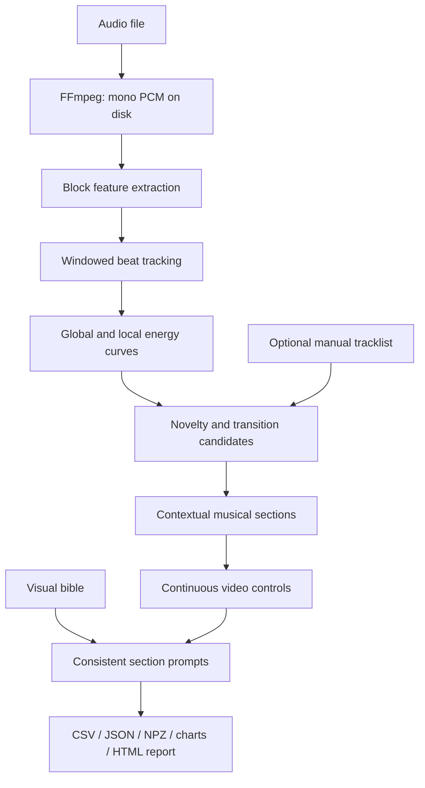

# Track Energy — Music Video Analyzer

A self-contained Windows 11 x64 command-line application for turning long DJ mixes into time-aligned musical energy, rhythm, section candidates, and continuous video controls. It creates a local HTML inspection report, charts, machine-readable timelines, and coherent video prompts. It does **not** generate video or upload audio.

Version: **0.1.0**. Built with Python, NumPy, SciPy, librosa, Matplotlib and FFmpeg; optional local transcription uses faster-whisper.

## What you can use it for

- Find high-energy moments, builds and breakdowns before editing a DJ-mix video.
- Review changes in intensity, rhythm and brightness across an entire recording.
- Export timestamped CSV/JSON data for your own editing, lighting or visualization tools.
- Produce section-by-section camera, movement, lighting and cutting suggestions.
- Create video prompts that retain one consistent visual world across a mix.
- Add a known tracklist to improve editorial structure, or optionally transcribe vocals.

This is an offline analysis and planning tool. It does not identify songs, render clips, edit a video timeline in an external application, or provide real-time playback synchronization. Musical labels and beat/downbeat estimates need human review.

## Contents

- [Installation and first run](#setup-and-first-run)
- [Typical editing workflow](#typical-editing-workflow)
- [Project layout](#layout)
- [Command-line options](#cli)
- [How the analysis works](#analysis-and-energy-model)
- [Rhythm, phases and track transitions](#rhythm-phases-and-track-transitions)
- [Output files and data contracts](#output-contracts)
- [Video direction and customization](#video-director-and-visual-bible)
- [Optional transcription](#optional-transcription)
- [Tests and reproducibility](#tests-and-reproducibility)
- [Troubleshooting](#troubleshooting)

## Requirements

- Windows 11 x64 and PowerShell (the wrappers support Windows PowerShell 5.1).
- Internet access for setup and the first download of an optional speech model.
- Disk space for the downloaded runtime/dependencies, your audio, results and roughly 318 MB of temporary decoded audio per hour of recording at default settings.
- No preinstalled Python or FFmpeg is required. A GPU is not needed for core analysis.

Windows is the supported installation path. Linux/macOS installers and a graphical application are not included. Runtime, processing time and optional model memory requirements depend on the recording and selected model; no fixed minimum RAM or speed guarantee has been benchmarked.

## Setup and first run

Download this repository using GitHub's **Code → Download ZIP** and extract it to a writable folder, or clone it using the HTTPS URL shown in **Code**. Open PowerShell in the extracted/cloned project folder:

```powershell
git clone https://github.com/ariia-git/Audio-track-analysis.git
cd Audio-track-analysis
```

Install the local runtime, then analyze your own file:

```powershell
.\setup.ps1
.\analyze.ps1 "input\mix.mp3"
# Equivalent entry point:
.\run.ps1 "input\mix.mp3"
```

Put your own audio in `input` first (setup creates this folder). Audio, generated output, downloaded runtimes and logs are deliberately excluded from Git. To try the application without supplying a recording, generate the deterministic 96-second demonstration after setup:

```powershell
.\runtime\python\python.exe -m tests.synthetic "input\synthetic mix.wav"
.\analyze.ps1 "input\synthetic mix.wav" --force
Start-Process ".\output\synthetic mix\report.html"
```

If PowerShell blocks local scripts, allow them for this shell only:

```powershell
Set-ExecutionPolicy -Scope Process -ExecutionPolicy Bypass
.\setup.ps1
```

Setup downloads the official Python 3.12.10 x64 embeddable runtime, bootstraps pip into that runtime, installs Windows wheels using the tested dependency constraints, and downloads Gyan's FFmpeg essentials build with SHA-256 verification against the provider's checksum. No global Python, Docker, WSL, administrator installation, or Developer Mode is needed. Downloaded archives, dependencies, compilation caches, temporary PCM and optional model data stay here. Internet access is needed for first setup; ordinary analysis then works offline. FFmpeg's current release is cached on first setup, and its bundled licenses remain under `runtime/ffmpeg`.

Setup is idempotent: it keeps installed runtimes, installs only missing/different dependencies, verifies imports and FFmpeg, and runs fast unit tests. A complete `runtime` folder can be moved with the project to another compatible Windows x64 computer; the embedded import path is relative. Wrappers locate the runtime using their own location. Input and explicit config/output arguments are relative to your shell's current directory. Defaults always refer to this project. No system PATH is changed.

## Typical editing workflow

1. Run setup, then analyze your recording with `.\analyze.ps1 "input\mix.mp3"`.
2. Open `output\mix\report.html` in a browser. Compare the energy curves, detected sections and track transitions while listening to the source recording separately.
3. Read `summary.json` for warnings and the strongest moments. Check automatic boundaries against your actual tracklist.
4. Add manual track starts if known, adjust analysis settings if necessary, and rerun with `--force`.
5. Customize `config\visual_bible.json` and rerun to produce prompts in your chosen visual style.
6. Use `video_timeline.json` and `video_prompts.json` in your own production workflow. Use `energy.csv` for spreadsheet inspection and `beats.json` for potential edit points.

Each input normally gets its own result folder named after the file without its extension. For `input\mix.mp3`, open the report with:

```powershell
Start-Process ".\output\mix\report.html"
```

The report is a local inspection page, not an audio player or video generator. Outputs can include your input's absolute path, filename and optional transcribed words; inspect them before sharing them separately.

## Layout

```text
README.md                 usage, design and limitations
setup.ps1                 project-local installation and fast self-test
bootstrap.ps1             shared local cache environment
analyze.ps1 / run.ps1      command-line wrappers
test.ps1                  complete automated tests
requirements.txt          direct core dependencies
requirements-lock.txt     tested transitive core constraints
requirements-whisper.txt  optional transcription dependency
config/
  default.json            analysis, sections and video parameters
  visual_bible.json       persistent visual world
  tracklist.example.json  example manual starts (not auto-loaded)
src/
  main.py                 CLI and pipeline orchestration
  audio.py                FFmpeg decoding to disk-backed mono PCM
  features.py             block spectral/rhythm feature extraction
  beats.py                overlapping-window beat tracking
  energy.py               robust global and rolling-local energy
  sections.py             contextual semantic labels
  track_boundaries.py     novelty and optional manual tracklist
  director.py / prompts.py continuous controls and world-consistent prompts
  transcription.py        isolated optional Whisper support
  outputs.py              streamed CSV/JSON exports
  visualization.py        charts and local HTML report
  config.py / utils.py     configuration, timestamps and local paths
tests/                    unit tests, integration tests, fixture generator
input/                    source audio
output/<mix-name>/        completed result folders
runtime/
  python/                 portable interpreter and site-packages
  ffmpeg/                 local executable and vendor licenses
  cache/                  downloads, models, plotting, JIT and temp files
logs/                     diagnostics preserved after failed analyses
```

## CLI

```powershell
.\analyze.ps1 --help
.\runtime\python\python.exe -m src.main --help
.\analyze.ps1 "input\mix.mp3" --interval 1.0
.\analyze.ps1 "input\mix.flac" --tracklist "config\tracklist.json"
.\analyze.ps1 "input\mix.m4a" --config "config\my-overrides.json"
.\analyze.ps1 "input\mix.wav" --output "output\my-comparison" --force
.\analyze.ps1 "input\mix.mp3" --debug
```

`--output` is the exact result folder, not a parent. All result paths must stay inside this project, outside its source/config/runtime/input directories. Existing output is protected by default. `--force` only replaces marked analyzer results; a failed analysis leaves the previous result untouched. Unrelated files added to a result folder are retained. Inputs with the same stem require distinct `--output` folders. Do not run two processes targeting the same output folder simultaneously.

| Option | Default / purpose |
|---|---|
| `input` | Required audio file path; quote paths containing spaces |
| `--output PATH` | Exact result folder; defaults to `output/<input-stem>` |
| `--interval SECONDS` | Export interval, default `0.5`; must be at least the fine interval |
| `--config PATH` | Partial JSON overrides merged with the defaults |
| `--tracklist PATH` | Manual track starts; otherwise loads `config/tracklist.json` if present |
| `--transcribe` | Request optional local speech transcription |
| `--whisper-model NAME` | Speech model, default `large-v3` |
| `--device auto\|cpu\|cuda` | Transcription device, default `auto` |
| `--force` | Replace artifacts in an existing marked analyzer result |
| `--debug` | Include detailed diagnostic logging |
| `--version` | Print software version and exit |
| `--help` | Print command help and exit |

For example, save this as `config/my-overrides.json` to export once per second, allow fewer short sections and suggest longer shots:

```json
{
  "interval": 1.0,
  "sections": {"minimum_seconds": 12},
  "video": {"shot_min_seconds": 2.0, "shot_max_seconds": 12.0}
}
```

Then run `.\analyze.ps1 "input\mix.mp3" --config "config\my-overrides.json" --force`. A supplied `--interval` takes precedence over the JSON interval. Start with defaults, review the report, and change one setting at a time.

## Analysis and energy model

The pipeline runs in this order:



Optional transcription runs separately from the musical feature model; its failure does not cancel the music analysis.

FFmpeg decodes MP3, WAV, FLAC, M4A and other supported audio into temporary mono float PCM at 22,050 Hz. The PCM is memory-mapped and released after feature extraction. Default temporary disk use is roughly 318 MB per hour of audio, plus outputs. Spectral transforms process 30-second blocks on a single absolute-time grid, carrying spectral differences across block edges. There is no quadratic full-mix similarity matrix. Fine feature arrays and onset envelopes grow linearly with duration; the waveform and full spectrogram are not duplicated in RAM.

The default 2,048-point Hann STFT has a 512-sample hop (~23 ms); features aggregate to 100 ms bins. Features include RMS, an A-weighted loudness approximation, spectral centroid/bandwidth/85% power rolloff, positive log-spectral onset strength, normalized spectral flux, zero crossings, sub-bass (20–60 Hz), bass (20–250 Hz), low-mid (250–500 Hz), mid (500–2,000 Hz), high-frequency energy, chroma, transient density, beat density and tempo. Loudness is **not calibrated LUFS**. Band features are linear RMS amplitudes. Chroma is an FFT pitch-class projection rather than chord recognition. Silence is gated using absolute RMS dBFS.

Positive amplitude/activity features are compressed with `log1p(100*x)` and scaled using whole-mix 5th/95th percentiles. Configurable weighted loudness, bass, onsets, transient density, centroid and high-frequency content produce `global_energy`. No per-track rescaling replaces this value, so contrasts between stronger and gentler tracks survive. It is a relative descriptor **within one mix**, not an absolute universal genre/intensity scale across unrelated files. A constant feature supplies no relative evidence.

| Field | Meaning |
|---|---|
| `global_energy` | Whole-mix weighted intensity, 0–1 |
| `local_energy` | Position in a rolling 60-second context, separately normalized |
| `micro_energy` | One-second smoothing for immediate movement |
| `smoothed_energy` | Eight-second phrase smoothing for stable visual control |
| `macro_energy` | Thirty-second smoothing for larger arcs |
| `energy_percentile` | Rank relative to all frames in this mix, 0–1 |
| `energy_delta` | Phrase-energy change per second over a four-second span |
| `energy_direction` | Rising/falling/stable, using the configured delta deadband |
| `rhythmic_intensity` | Normalized onset and transient evidence |
| `spectral_intensity` | Normalized brightness, high-band amplitude and flux |

These are centered, offline curves: they use future context and are not designed for a live visualizer. User-facing intervals are averaged, not just subsampled. Energy configuration is in `config/default.json`; partial override JSON inherits other defaults and rejects unknown keys. Weights need not sum to one; the calculation divides by their sum. Durations are seconds, phase-energy thresholds and control ranges are 0–1, build thresholds are energy units per second, and normalization percentiles use 0–100. `audio.fine_interval` cannot exceed the exported interval.

## Rhythm, phases and track transitions

Librosa's dynamic-programming beat tracker runs over overlapping windows, retaining beats only in each window's central region. This accommodates tempo changes without imposing one BPM on an entire DJ mix. Timestamps retain ~23 ms frame resolution, although true accuracy depends on the recording. Heuristic confidence combines onset support and interval regularity. Silent frames cannot generate beats. No-beat results remain valid analyses.

Downbeats/bar starts use bass-accent phase under the configured meter (four beats per bar by default). Phrase starts count eight such bars. **These are explicitly marked heuristics, not actual meter or downbeat recognition.** Offsets can drift, particularly at transitions, rubato, half/double-tempo estimates and non-4/4 passages.

Section boundaries combine before/after timbre, chroma, rhythm, tempo and energy novelty, energy-slope peaks, sustained-energy threshold crossings, and supplied track boundaries. Closely spaced automatic changes are suppressed using the minimum section duration. Manual boundaries may create shorter sections. Labels use segment energy, percentile, trend and preceding context: a drop requires both a prior rise and an abrupt sufficiently strong increase; low post-high regions can become breakdowns; sustained high regions can become peaks; gradual rises become builds. The detector can under-segment a long uniform region, deliberately producing one meaningful control segment rather than arbitrary fixed chunks.

Track transition candidates use the same structural novelty with a longer default minimum spacing of 90 seconds. Confidence is uncalibrated contrast strength, not a probability of correctness. The detector does not identify songs, force ten tracks, or promise a one-to-one correspondence with the DJ's tracklist. Crossfades, mastered loudness, bass-heavy quiet sections and ambiguous musical structure can fool all these heuristics. Human review of the report is expected before final editing.

Create `config/tracklist.json` or pass `--tracklist`:

```json
[
  {"name": "Track 1", "start": "00:00:00"},
  {"name": "Track 2", "start": "00:05:42"}
]
```

Times may be numeric seconds, MM:SS or HH:MM:SS (fractional seconds accepted). Starts must be strictly increasing and before the end. An unspecified opening is inserted if the first start is after zero. By default manual starts replace selected automatic boundaries, while automatic candidates remain available for inspection. Set `boundaries.manual_mode` to `combine` to add automatic candidates sufficiently far from manual starts. Manual confidence of 1 means user-supplied, not verified ground truth.

## Output contracts

All times are seconds from the decoded audio start; spans are `[start, end)` and cover the complete decoded duration.

| File | Contents |
|---|---|
| `analysis.json` | Schema/software versions, input metadata, analysis sample rate, parameters, feature definitions, normalization limits, dependency versions, exact visual bible and artifact list |
| `energy.csv`, `energy.json` | Human-readable aggregated feature/control rows (0.5 seconds default); timestamp strings include milliseconds |
| `features.npz` | Compressed fine feature/control arrays, opened with `numpy.load(..., allow_pickle=False)` |
| `beats.json` | Beats, confidence, window BPM, onsets, heuristic downbeats/bars/phrases and method descriptions |
| `sections.json` | Contiguous sections, semantic confidence and contextual evidence |
| `track_boundaries.json` | All automatic candidates and the selected manual/automatic boundaries |
| `video_timeline.json` | One control segment per meaningful musical section |
| `video_prompts.json` | Coherent base, energy modifier, complete and negative prompts per segment |
| `summary.json` | Duration, counts, strongest sections, warnings and transcription status |
| `analysis.log` | Detailed run diagnostics |
| `energy_curve.png` | Global/local/phrase/macro comparison |
| `feature_curves.png` | Loudness, bass, onset activity and brightness |
| `sections_timeline.png` | Semantic regions and selected track-boundary lines |
| `report.html` | Offline inspection page with charts, section table and local artifact links |
| `transcript.json`, `words.json` | Only written after successful optional transcription |

Empty onset/beat arrays are legitimate. JSON disallows NaN/Infinity. Energy CSV contains all fine features aggregated over each export interval, including chroma and the requested additional controls. `analysis_sample_rate` is the resampled analysis rate, not the original media rate. The `.analyzer-result` marker protects overwrite operations.

## Video director and visual bible

Edit `config/visual_bible.json` to set the theme, environment, palette, camera/lens language, texture, recurring characters/objects, lighting and forbidden elements. Every generated prompt carries this same world description. The energy modifier changes cinematography and intensity without inventing a new scene at every segment. Lyrics are exported separately; this version does not automatically insert lyrics into visual prompts.

The director maps energy through a configurable response exponent, combines it with rhythmic intensity, and reduces movement/effects during falling energy. Numeric controls are continuous: movement, camera speed/aggression, visual density, effects, lighting, transition strength and beat-sync strength use 0–1. `cut_frequency` is **suggested cuts per second**, the reciprocal of `suggested_shot_duration`. Shot durations are suggestions within configured limits, not a hard list of rendered clips. Prose modifiers have four broad intensity bands, with an additional falling-energy instruction.

A future video system can create clips using each segment's `complete_prompt`, split a long segment into shots around its suggested duration, interpolate numeric controls using `features.npz`, snap edits to reliable beats, and preserve the bible as persistent generation context. The segment's end and duration are authoritative; suggested shot length can exceed an unusually short final/manual segment and should then be clamped by the renderer. No generator credentials or service-specific integration are included.

## Optional transcription

Core setup does not install Whisper or download any speech model.

```powershell
.\setup.ps1 -WithWhisper
.\analyze.ps1 "input\mix.mp3" --transcribe --whisper-model large-v3 --device auto
# Explicit CPU:
.\analyze.ps1 "input\mix.mp3" --transcribe --whisper-model small --device cpu --force
```

`auto` tries CUDA if CTranslate2 detects a GPU and retries on CPU if GPU initialization/inference fails. Explicit `cuda` reports a transcription failure instead of silently switching. Optional failures are logged in the summary while the full music analysis still succeeds. Models use `runtime/cache/huggingface/models`; hub caches and temporary files are also project-local. The first requested model needs a network download. CPU fallback for large models can be slow, and vocals over music are substantially less reliable than clean speech. Whisper can hallucinate words during instrumental passages; review timestamps and text.

GPU execution additionally needs compatible NVIDIA CUDA/cuBLAS/cuDNN DLLs. The current [faster-whisper GPU instructions](https://github.com/SYSTRAN/faster-whisper#gpu) describe the supported CUDA 12/cuDNN 9 combination. This project does not install GPU drivers or system-wide CUDA. Optional transcription and actual model inference are not part of the core acceptance test; failure isolation is tested with a simulated unavailable model.

## Tests and reproducibility

```powershell
.\test.ps1
# Generate the deterministic fixture again if needed:
.\runtime\python\python.exe -m tests.synthetic "input\synthetic mix.wav"
.\analyze.ps1 "input\synthetic mix.wav" --force
```

Tests cover robust normalization, silence, preservation of inter-region intensity, timestamp rollover, context-aware drop/build/breakdown/peak labels, continuous monotonic director mappings, falling-energy release, configuration validation, manual tracks, and prompt continuity. Integration tests exercise decoding, the quiet/build/rhythm/breakdown/second-peak/fade fixture, approximate 120 BPM tracking, complete timeline coverage, JSON/CSV validity, PNG decoding, referenced paths, corrupt files, very short input, optional failure isolation and overwrite protection.

The first beat-analysis call can take noticeably longer because Numba compiles routines into `runtime/cache/numba`. Subsequent runs reuse that cache. Automated tests use synthetic audio; no claim of human-level phase accuracy or validation against a real labelled DJ-mix dataset is made.

## Troubleshooting

- **Missing Python/FFmpeg or import failure:** rerun `setup.ps1`; use the supplied local interpreter, never a global pip. Avoid relocating individual subfolders.
- **Download/proxy failure:** allow Python.org, bootstrap.pypa.io, PyPI and Gyan's download host through your network. Rerun setup; unfinished downloads use `.partial` files and are retried.
- **FFmpeg checksum mismatch:** delete only `runtime/cache/downloads/ffmpeg-release-essentials.zip` and its `.sha256` file, then rerun setup. A release can change between archive and checksum downloads.
- **Audio cannot decode:** inspect the reported FFmpeg error and the preserved `logs/failed-*.log`. Ensure the file actually has an audio stream and is not truncated/DRM protected.
- **No beats or empty downbeats:** valid for silence, short audio, or weak percussion; other controls remain usable.
- **Unexpected phases:** tune weights, section sensitivity/minimum duration or add a manual tracklist. Confidence scores are heuristic and not calibrated probabilities.
- **Disk full:** decoding needs local temporary PCM plus output space. Failed runs normally clean temporary PCM and staging folders; a terminated process may leave a hidden staging folder or `runtime/cache/tmp/decode-*` folder that can be removed when no analysis is running.
- **Whisper import/model/CUDA failure:** confirm `setup.ps1 -WithWhisper` ran, inspect the summary warning, or use `--device cpu`. Music analysis does not require it.
- **Output already exists:** use a new `--output` or `--force` for a marked prior result. Do not target your source/input folder.

Implementation references: [Python Windows embeddable distribution](https://docs.python.org/3.12/using/windows.html#the-embeddable-package), [Gyan FFmpeg builds](https://www.gyan.dev/ffmpeg/builds/), [librosa](https://librosa.org/), and [faster-whisper](https://github.com/SYSTRAN/faster-whisper). These projects retain their respective licenses; installed copies and FFmpeg's distribution contain their notices.

## Development and license

To work on the analyzer, clone the repository, run `setup.ps1`, edit the modules under `src`, then run `test.ps1`. Core tests use generated audio, so no personal recordings or model downloads are required. See [VALIDATION.md](VALIDATION.md) for recorded verification and its limits.

Keep recordings, generated reports, models, caches and downloaded executables out of commits. The repository's `.gitignore` excludes the complete `input`, `output`, `runtime` and `logs` directories. Setup recreates these directories after a fresh clone.

Project source is licensed under the [MIT License](LICENSE). Third-party runtimes, libraries, models and any audio you supply have their own licenses and terms.
